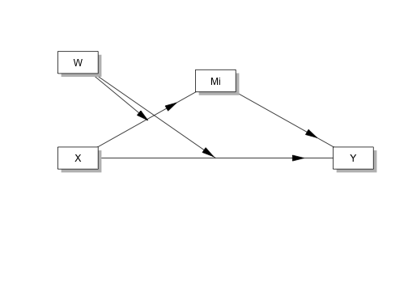
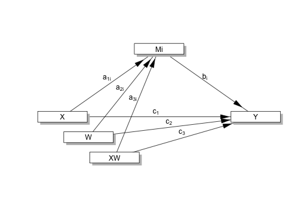
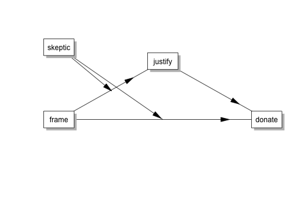
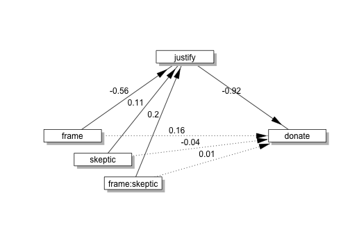
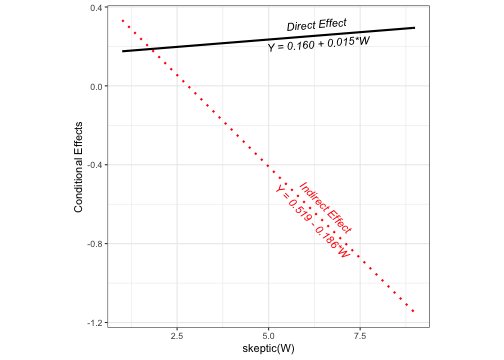

The `processR` package aims to be a user-friendly way to perform moderation, mediation, moderated mediation and moderated moderation in R. This package is inspired form famous PROCESS macro for SPSS and SAS created by Andrew Hayes.

## Installation

You can install the `processR` package from github.


```r
if(!require(devtools)) install.packages("devtools")
devtools::install_github("cardiomoon/processR")
```
 
## What does this package cover ? 

The `processR` package covers moderation, mediation, moderated mediation and moderated moderation with R. Supporting models are as follows.


```r
library(processR)
sort(pmacro$no)
```

```
 [1]  1.0  2.0  3.0  4.0  4.2  5.0  6.0  6.3  6.4  7.0  8.0  9.0 10.0 11.0
[15] 12.0 13.0 14.0 15.0 16.0 17.0 18.0 19.0 20.0 21.0 22.0 23.0 24.0 28.0
[29] 29.0 30.0 31.0 35.0 36.0 40.0 41.0 45.0 49.0 50.0 58.0 59.0 60.0 61.0
[43] 62.0 63.0 64.0 65.0 66.0 67.0 74.0 75.0 76.0
```

Currently, 51 models are supported.

## Example: Moderated Mediation (PROCESS macro model 8)

I will explain functions of processR package by a example.

## Concept Diagram and Statistical Diagram

You can draw concept diagram and statistical diagram easily. For example, you can draw the concept diagram for PROCESS macro model 8.


```r
pmacroModel(8)
```



You can draw statistical diagram of this model.


```r
statisticalDiagram(8)
```



## Make model equation for analysis

This package uses `lavaan` and `mediation` packages for analysis. The `lavaan` package is extremely customizable and can also model latent variables if your measurement model requires it. But it is difficult to figure out the model equation for analysis. You can make model equation easily. For example, if you want to perfrom moderated mediation with data `disaster` with the following concept model.


```r
labels=list(X="frame",M="justify",Y="donate",W="skeptic")
pmacroModel(8,labels=labels)
```


There is one moderator `skeptic` in this model. The moderating site is "a" and "c". You can make model equation by the following command.


```r
moderator=list(name="skeptic",site=list(c("a","c")))
model=tripleEquation(X="frame",M="justify",Y="donate",moderator=moderator)
cat(model)
```

```
justify~a1*frame+a2*skeptic+a3*frame:skeptic
donate~b1*justify+c1*frame+c2*skeptic+c3*frame:skeptic
skeptic ~ skeptic.mean*1
skeptic ~~ skeptic.var*skeptic
indirect :=(a1+a3*skeptic.mean)*(b1)
direct :=c1+c3*skeptic.mean
total := direct + indirect
indirect.below :=(a1+a3*(skeptic.mean-sqrt(skeptic.var)))*(b1)
indirect.above :=(a1+a3*(skeptic.mean+sqrt(skeptic.var)))*(b1)
direct.below:=c1+c3*(skeptic.mean-sqrt(skeptic.var))
direct.above:=c1+c3*(skeptic.mean+sqrt(skeptic.var))
total.below := direct.below + indirect.below
total.above := direct.above + indirect.above
prop.mediated.below := indirect.below / total.below
prop.mediated.above := indirect.above / total.above
```

With this model syntax, you can analyze moderated mediation with sem() function of lavaan package. 


```r
library(lavaan)
semfit=sem(model=model,data=disaster)
summary(semfit)
```

```
lavaan 0.6-3 ended normally after 36 iterations

  Optimization method                           NLMINB
  Number of free parameters                         18

  Number of observations                           211

  Estimator                                         ML
  Model Fit Test Statistic                     136.428
  Degrees of freedom                                 2
  P-value (Chi-square)                           0.000

Parameter Estimates:

  Information                                 Expected
  Information saturated (h1) model          Structured
  Standard Errors                             Standard

Regressions:
                   Estimate  Std.Err  z-value  P(>|z|)
  justify ~                                           
    frame     (a1)   -0.562    0.175   -3.211    0.001
    skeptic   (a2)    0.105    0.027    3.844    0.000
    frm:skptc (a3)    0.201    0.040    5.077    0.000
  donate ~                                            
    justify   (b1)   -0.923    0.083  -11.113    0.000
    frame     (c1)    0.160    0.216    0.741    0.459
    skeptic   (c2)   -0.043    0.034   -1.248    0.212
    frm:skptc (c3)    0.015    0.051    0.295    0.768

Covariances:
                   Estimate  Std.Err  z-value  P(>|z|)
  frame ~~                                            
    frame:skeptic     0.854    0.096    8.890    0.000

Intercepts:
                   Estimate  Std.Err  z-value  P(>|z|)
    skeptic (skp.)    3.378    0.140   24.196    0.000
   .justify           2.452    0.120   20.416    0.000
   .donate            7.291    0.250   29.189    0.000
    frame             0.479    0.034   13.919    0.000
    frm:skp           1.637    0.152   10.771    0.000

Variances:
                   Estimate  Std.Err  z-value  P(>|z|)
    skeptic (skp.)    4.113    0.400   10.271    0.000
   .justify           0.648    0.063   10.271    0.000
   .donate            0.943    0.092   10.271    0.000
    frame             0.250    0.024   10.271    0.000
    frm:skp           4.877    0.475   10.271    0.000

Defined Parameters:
                   Estimate  Std.Err  z-value  P(>|z|)
    indirect         -0.108    0.106   -1.019    0.308
    direct            0.211    0.134    1.570    0.116
    total             0.103    0.170    0.603    0.546
    indirect.below    0.268    0.133    2.011    0.044
    indirect.above   -0.485    0.137   -3.547    0.000
    direct.below      0.180    0.168    1.073    0.283
    direct.above      0.241    0.170    1.420    0.156
    total.below       0.449    0.212    2.121    0.034
    total.above      -0.244    0.209   -1.167    0.243
    prop.medtd.blw    0.598    0.257    2.326    0.020
    prop.meditd.bv    1.990    1.449    1.373    0.170
```


You can extract parameter estimates of this model.


```r
estimatesTable(semfit)
```

```
  Variables    Predictors     B   SE      z       p     β
1   justify         frame -0.56 0.18  -3.21   0.001 -0.32
2   justify       skeptic  0.11 0.03   3.84 < 0.001  0.24
3   justify frame:skeptic  0.20 0.04   5.08 < 0.001  0.50
4    donate       justify -0.92 0.08 -11.11 < 0.001 -0.64
5    donate         frame  0.16 0.22   0.74   0.459  0.06
6    donate       skeptic -0.04 0.03  -1.25   0.212 -0.07
7    donate frame:skeptic  0.01 0.05   0.29   0.768  0.03
```

The estimatesTable2 make a flextable object of this model.


```r
estimatesTable2(semfit)
```

```
Error in knit_print.flextable(x, ...): `render_flextable` needs to be used as a renderer for a knitr/rmarkdown R code chunk (render by rmarkdown)
```

If you want to get black and white table for publication purpose, please set the argument vanilla=TRUE.


```r
estimatesTable2(semfit,vanilla = TRUE)
```

```
Error in knit_print.flextable(x, ...): `render_flextable` needs to be used as a renderer for a knitr/rmarkdown R code chunk (render by rmarkdown)
```

You can draw statistical diagram with the analysis result.


```r
statisticalDiagram(8,labels=labels,fit=semfit,whatLabel="est")
```



## Analysis with simple regression models

You can analyze this model using lm() function. You can make regression equations for moderator and dependent variables. 


```r
equations=regEquation(X="frame",M="justify",Y="donate",moderator=moderator)
cat(equations)
```

```
justify ~ frame
donate ~  frame+justify+frame*skeptic
```

With this equations, you can perform linear regression. First, you can use moderator as a dependent variable. 


```r
eq=unlist(strsplit(equations,"\n"))
fit=lapply(1:2,function(i) {
    lm(as.formula(eq[i]),data=disaster)
})
summary(fit[[1]])
```

```

Call:
lm(formula = as.formula(eq[i]), data = disaster)

Residuals:
    Min      1Q  Median      3Q     Max 
-1.8024 -0.6867 -0.0024  0.5976  3.8633 

Coefficients:
            Estimate Std. Error t value Pr(>|t|)    
(Intercept)  2.80236    0.08862  31.623   <2e-16 ***
frame        0.13437    0.12809   1.049    0.295    
---
Signif. codes:  0 '***' 0.001 '**' 0.01 '*' 0.05 '.' 0.1 ' ' 1

Residual standard error: 0.9294 on 209 degrees of freedom
Multiple R-squared:  0.005238,	Adjusted R-squared:  0.0004783 
F-statistic:   1.1 on 1 and 209 DF,  p-value: 0.2954
```

The second regression model uses dependent variable.  


```r
summary(fit[[2]])
```

```

Call:
lm(formula = as.formula(eq[i]), data = disaster)

Residuals:
    Min      1Q  Median      3Q     Max 
-3.4326 -0.5205  0.1216  0.6898  3.1508 

Coefficients:
              Estimate Std. Error t value Pr(>|t|)    
(Intercept)    7.29147    0.27368  26.642   <2e-16 ***
frame          0.16032    0.26766   0.599    0.550    
justify       -0.92269    0.08403 -10.981   <2e-16 ***
skeptic       -0.04257    0.04693  -0.907    0.365    
frame:skeptic  0.01492    0.06892   0.217    0.829    
---
Signif. codes:  0 '***' 0.001 '**' 0.01 '*' 0.05 '.' 0.1 ' ' 1

Residual standard error: 0.9828 on 206 degrees of freedom
Multiple R-squared:  0.454,	Adjusted R-squared:  0.4434 
F-statistic: 42.82 on 4 and 206 DF,  p-value: < 2.2e-16
```

## Table summarizing coefficients of two models

You can make table summarizing two models.


```r
x=modelsSummary(fit,labels=labels)
modelsSummaryTable(x)
```

```
Error in knit_print.flextable(x, ...): `render_flextable` needs to be used as a renderer for a knitr/rmarkdown R code chunk (render by rmarkdown)
```

## Conditional direct and indirect effects 

You can make table summarizing the conditional direct and indirect effects. By default, the equation uses mean $\pm$ sd of moderator. The following table summarizes te direct and indirect effect when the moderator is mean, mean + sd and mean - sd. 

```r
x=modmedSummary(semfit,mod="skeptic")
modmedSummaryTable(x)
```

```
Error in knit_print.flextable(x, ...): `render_flextable` needs to be used as a renderer for a knitr/rmarkdown R code chunk (render by rmarkdown)
```

## Plots for conditional direct and indirect effects 

You can draw summarizing the conditional direct and indirect effects.


```r
conditionalEffectPlot(semfit,data=disaster,mod="skeptic")
```



## Shiny App

I have developed a shiny app. You can test the app at http://web-r.space:3838/processR.
I will appreciate any comment.
